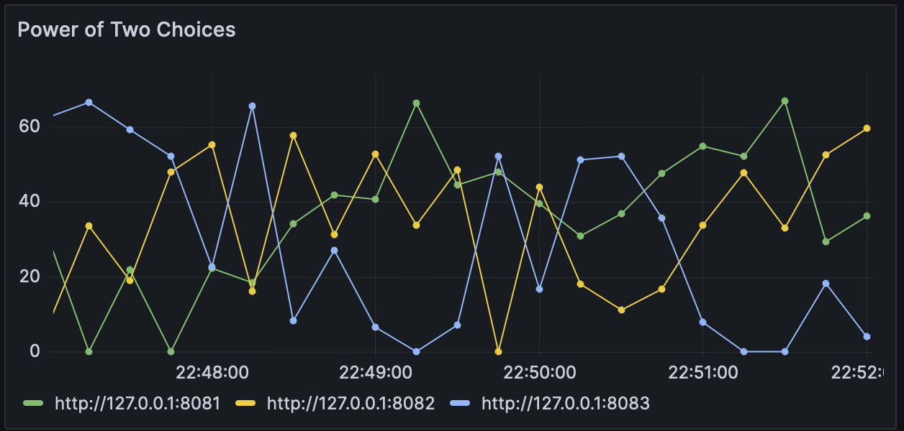

# Load Balancing algorithms in go

## Testing

You need the go toolchain installed. Then, run `go run main.go` in the root directory.
This command will start a server in the 8080 port to receive requests. There is one route for each balancing algorithm:

* `/rr` - Round Robin
* `/p2c` - Power of Two Choices

You can test the load balancing algorithms by sending requests to the server. For example, using curl:

```bash
curl http://localhost:8080/rr
```

Or

```bash
curl http://localhost:8080/p2c
```

## Algorithms

### Round Robin

A uniform/weighted round robin load balancer. Servers are assigned weights, determining selection frequency. Higher weights are favored more. If weights are equal, servers are chosen uniformly.

How it works:

* Servers are assigned weights, determining selection frequency. Higher weights are favored more. If weights are equal, servers are chosen uniformly.
* Keep track of the index of the last server used.
* When a new request comes in, use the next server in the list.
* If the end of the list is reached, start over from the beginning.


### Power of Two Choices

A power of two choices (P2C) load balancer. Servers are chosen uniformly at random, and the least loaded server is chosen. This load may be determined by any metric, such as CPU usage, memory usage, or latency.

How it works:

* If the list has only one server, choose that server.
* If the list has two servers, decide between the two based on their load.
* If the list has more than two servers, choose two at random and decide between them.


